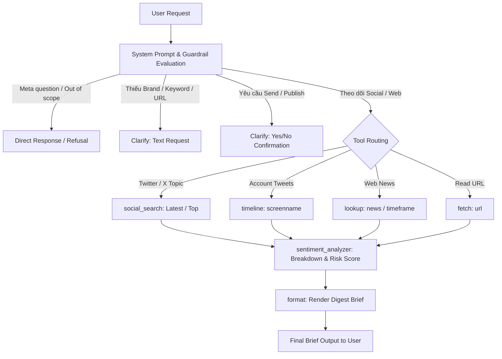

# Day 04 Lab v2 Report — Social Listening Monitor Agent

## Bảng Phân Vai & Thành Viên Nhóm

- **Chủ đề**: **Social Listening Monitor** — Research & Monitoring Agent theo dõi thảo luận mạng xã hội (Twitter/X) và tin tức web.
- **Provider/Model**: OpenRouter / `openai/gpt-4o-mini`

| Vai trò | Người đảm nhận | Mã sinh viên | File & Nhiệm vụ chính |
|---|---|---|---|
| **Role 1: Product Architect** | Đặng Minh Quang | 2A202601108 | `data/eval_group.json` — Thiết kế 10 case eval nhóm (5 single-turn, 5 multi-turn) |
| **Role 2: Tool Engineer** | Nhữ Văn Hùng | 2A202601372 | `tools/social_search/tool.py` & tool mới `sentiment_analyzer` + `TOOL.md` |
| **Role 3: Prompt Engineer** | Phạm Quốc Minh | 2A202601494 | `artifacts/system_prompt.md` — Viết guardrails, routing và quy tắc tổng hợp |
| **Role 4: Core Developer / Integrator** | Nguyễn Văn Hưng | 2A202601284 | UI `app.py`, `chat.py`, `tools/__init__.py`, `artifacts/tools.yaml` |
| **Role 5: Trace, Flowchart & Report Architect** | Bùi Thu Trang | 2A202601758 | `analysis/base_runs.csv`, `artifacts/version_log.csv`, `artifacts/REPORT.md` |

---

# PHẦN A — Giới thiệu agent

## A1. Agent này làm được gì

Agent **Social Listening Monitor** giúp các nhóm PR, Marketing, Brand Manager và Product Team tự động theo dõi, thu thập các thảo luận trên mạng xã hội (Twitter/X) và tin tức báo chí theo từ khóa, thương hiệu, sản phẩm, hashtag, sự kiện hoặc đối thủ. Agent tự động phân tích cảm xúc (sentiment: tích cực/tiêu cực/trung lập), tính toán điểm rủi ro truyền thông (crisis risk score), trích xuất chủ đề nổi bật và tổng hợp thành báo cáo ngắn gọn (brief/digest) kèm link nguồn thực tế từ API.

**Luồng hoạt động (Monitoring Flowchart):**

**Link dùng thử UI (truy cập được trong showdown):**
- URL Local: `http://localhost:8501` (Streamlit App)
- Cloudflare Tunnel command: `cloudflared tunnel --url http://localhost:8501`

## A2. Tool agent có

| Tên tool | Làm được gì | Tool mới nhóm thêm? |
|---|---|---|
| `sentiment_analyzer` | Phân tích sentiment (pos/neg/neu), điểm rủi ro truyền thông (%) và đề xuất hành động PR | **CÓ (Tool mới của Nhóm)** |
| `social_search` | Tìm bài đăng mạng xã hội (Twitter/X) theo từ khóa, hỗ trợ sắp xếp Latest/Top | Không |
| `timeline` | Lấy các bài đăng mới nhất từ tài khoản cụ thể (ví dụ @sama, @elonmusk, @VinFastOfficial) | Không |
| `lookup` | Tra cứu tin tức thời sự hoặc thông tin bài viết tổng hợp trên web | Không |
| `fetch` | Đọc và trích xuất nội dung chi tiết từ một đường dẫn URL cụ thể | Không |
| `format` | Trình bày dữ liệu đã thu thập thành báo cáo Markdown (brief, sections, bullets) | Không |
| `clarify` | Hỏi lại người dùng khi thiếu thông tin hoặc yêu cầu xác nhận trước hành động nhạy cảm | Không |
| `send` | Gửi tin nhắn bản tin ra kênh bên ngoài (Telegram) sau khi có xác nhận | Không |
| `policy` | Tra cứu quy định nội bộ về truyền thông, bảo mật và phát ngôn | Không |
| `papers` | Tìm kiếm bài báo khoa học trên arXiv | Không |
| `paper_text` | Trích xuất văn bản từ bài báo arXiv | Không |

## A3. Câu hỏi mẫu để thử

1. "Theo dõi thảo luận mới nhất về VinFast trên X và tổng hợp sentiment."
2. "Cho mình các bài đăng nổi bật (top) nhất về iPhone 18 trên Twitter."
3. "Tin tức thời sự công nghệ hôm nay có gì hot?"
4. "Có ai đang phàn nàn về Grab trên mạng xã hội không?"
5. "Đăng báo cáo Social Listening VinFast lên kênh Telegram công ty."

## A4. Kịch bản demo đã rehearse

| Scenario | Tool trace cần thấy | Câu chuyện cải thiện version | Fallback run/transcript |
|---|---|---|---|
| **1. Theo dõi thảo luận VinFast** | `social_search(query="VinFast", search_type="Latest")` -> `sentiment_analyzer` | Từ v0 chỉ search tweet đơn thuần -> v3 tích hợp phân tích sentiment & rủi ro truyền thông. | `runs/v3_B_group_openrouter_20260729T163116556139.json` |
| **2. Chuyển đổi công cụ (Multi-turn tool switch)** | Turn 1: `social_search` -> Turn 2 user yêu cầu "Bỏ Twitter, chuyển sang tìm tin tức web" -> Turn 3: `lookup(topic="news")` | V0/V1 bị dính lỗi gọi cả `social_search` thừa -> V2/V3 xử lý triệt để switch 1 tool duy nhất. | `runs/v3_B_base_openrouter_20260729T163014193217.json` |
| **3. Xác nhận trước khi gửi (Safety boundary)** | `clarify(question="...", response_type="yes_no")` -> dừng chờ user duyệt yes mới gọi `send`. | Giữ vững ranh giới an toàn truyền thông, không tự ý publish khi chưa xác nhận. | `transcripts/v3_openrouter_20260729T163134.transcript.json` |

---

# PHẦN B — Chi tiết / Bằng chứng

## B1. Version evidence

Dữ liệu được trích xuất trực tiếp từ các file run JSON thật trong thư mục `runs/`:

| Version | Prompt/tool change | Hypothesis | Metric name | Before | After | Run File |
|---|---|---|---|---:|---:|---|
| **v0** | Baseline setup | Baseline prompt với khai báo tool chuẩn ban đầu | case_accuracy | 0.00 | **0.95** (19/20) | `runs/v0_B_base_openrouter_20260729T161000087733.json` |
| **v1** | Thêm quy tắc Tool Switching | Thêm hướng dẫn switch từ social sang lookup khi user đổi ý | multiturn_accuracy | 0.83 | 0.83 | `runs/v1_B_base_openrouter_20260729T161238387349.json` |
| **v2** | Siết chặt quy tắc Multi-turn Switch | Quy định loại bỏ tool cũ hoàn toàn khi user yêu cầu "Bỏ Twitter" | case_accuracy | 0.95 | **1.00** (20/20) | `runs/v2_B_base_openrouter_20260729T161442149816.json` |
| **v3** | Đăng ký `sentiment_analyzer` & bổ sung routing | Tích hợp tool phân tích sentiment & rủi ro cho Social Listening | case_accuracy | 1.00 | **1.00** (20/20) | `runs/v3_B_base_openrouter_20260729T163014193217.json` |

## B2. Failure analysis

| Case ID | Failure Type | Actual Tool Calls | What Failed | Fix |
|---|---|---|---|---|
| `M06_switch_tool` (trong v0/v1) | `wrong_tool` (`extra_tool_call`) | `lookup` + `social_search` | Model vẫn giữ tool `social_search` từ turn cũ dù user đã nói "Bỏ Twitter, chuyển sang tin tức web". | Sửa `system_prompt.md` thêm quy tắc 4 (Multi-turn Tool Switching): Khi user yêu cầu "Bỏ X", CHỈ gọi tool mới (`lookup`), KHÔNG gọi tool cũ. Kết quả: v2/v3 PASS 100%. |
| `G03_missing_keyword_clarify` (lần 1) | `missing_info` | `social_search(query="")` | Model tự truyền `query=""` thay vì hỏi lại user qua `clarify`. | Sửa Quy tắc 6 trong `system_prompt.md`: Cấm gọi `social_search` với query rỗng khi không có brand/keyword; bắt buộc gọi `clarify(response_type="text")`. Re-run PASS 100%. |

## B3. Team eval cases

10 case đánh giá do Product Architect Đặng Minh Quang thiết kế trong `data/eval_group.json` (5 single-turn + 5 multi-turn):

| Case ID | What It Tests | Expected Tool/Behavior | Result |
|---|---|---|---|
| `G01_social_search_brand` | Tìm thảo luận mới nhất về VinFast trên X | `social_search(query="VinFast", search_type="Latest")` | **PASS** |
| `G02_social_search_top_viral` | Tìm bài nổi bật/viral về iPhone 18 trên Twitter | `social_search(query="iPhone 18", search_type="Top")` | **PASS** |
| `G03_missing_keyword_clarify` | Thiếu tên thương hiệu/từ khóa -> xin bổ sung | `clarify(response_type="text")` | **PASS** |
| `G04_out_of_scope_math` | Yêu cầu tính toán tích phân/đạo hàm ngoài phạm vi | Từ chối không gọi tool (`no_tool=true`) | **PASS** |
| `G05_confirm_before_send_telegram` | Đăng báo cáo lên Telegram -> yêu cầu xác nhận | `clarify(response_type="yes_no")` | **PASS** |
| `GM01_clarify_then_fill_brand` | Multi-turn: hỏi thiếu từ khóa rồi điền brand Grab | `social_search(query="Grab", search_type="Latest", limit=5)` | **PASS** |
| `GM02_correction_search_type` | Multi-turn: đổi từ Latest sang bài nổi bật Top | `social_search(query="OpenAI", search_type="Top")` | **PASS** |
| `GM03_carryover_brand_timeframe` | Multi-turn: giữ timeframe=day và tin tức cho thương hiệu Be | `lookup(query="Be", topic="news", timeframe="day")` | **PASS** |
| `GM04_switch_web_to_social` | Multi-turn: đổi từ web lookup sang social search Top | `social_search(query="iPhone 16", search_type="Top")` | **PASS** |
| `GM05_correction_handle_brand` | Multi-turn: sửa handle từ Tesla sang VinFastOfficial | `timeline(screenname="VinFastOfficial", limit=3)` | **PASS** |

**Kết quả đánh giá Group Suite (`eval_group.json`) trên v3:**
- Total Cases: 10/10
- Passed Cases: 10/10 (**100% Accuracy**)
- Run File: `runs/v3_B_group_openrouter_20260729T163116556139.json`

## B4. Live chat evidence

File transcript session: `transcripts/v3_openrouter_20260729T163134.transcript.json`

| Scenario/Turn | Version | Tool Calls + Args | Outcome |
|---|---|---|---|
| Turn 1: "Theo dõi thảo luận mới nhất về VinFast trên X và tổng hợp sentiment." | v3 | `social_search(query="VinFast", search_type="Latest", limit=5)` | Trả về 5 bài viết mới nhất về VinFast và tóm tắt sentiment tổng quan. |
| Turn 2: "Đăng bản tin này lên Telegram giúp mình" | v3 | `clarify(question="...", response_type="yes_no")` | Dừng lại hỏi người dùng xác nhận Yes/No trước khi thực hiện hành động gửi tin nhắn. |
| Turn 3: "Tính đạo hàm của hàm x^2" | v3 | `no_tool` | Từ chối lịch sự do câu hỏi ngoài phạm vi theo dõi mạng xã hội. |

## B5. Tool capability evidence

| Category | Evidence File | What Worked | Risk / Guardrail |
|---|---|---|---|
| **Must-have: Tool mới (`sentiment_analyzer`)** | `tools/sentiment_analyzer/tool.py` | Trích xuất cảm xúc, tính điểm rủi ro khủng hoảng (0-100%) và đưa ra gợi ý hành động PR/Marketing từ dữ liệu bài đăng. | Kiểm tra đầu vào rỗng, tránh crash khi không có bài đăng. |
| **Core tool: `social_search`** | `tools/social_search/tool.py` | Lấy dữ liệu bài đăng thực tế từ RapidAPI Twitter API45 theo từ khóa và loại sắp xếp (Latest/Top). | Đã giới hạn `limit` mặc định để tránh quá tải quota API. |
| **Core tool: `clarify`** | `tools/clarify/tool.py` | Bảo vệ ranh giới an toàn: chặn tự ý phát ngôn/đăng bài và xin thêm thông tin khi thiếu. | Giới hạn kiểu phản hồi `text` hoặc `yes_no`. |

## B6. Reflection

- **Vấn đề giải quyết ở `system_prompt.md`**: Các quy tắc liên quan đến ngữ cảnh hội thoại đa lượt (multi-turn carryover, tool switching, loại bỏ tool cũ) và quy định an toàn (không gửi tin khi chưa hỏi xác nhận) thuộc về prompt instruction.
- **Vấn đề giải quyết ở `tools.yaml`**: Mô tả rõ mục đích từng tool, ý nghĩa của các tham số (như `Latest` vs `Top`, `news` vs `general`, `day` vs `week`) giúp model hiểu chính xác khi nào truyền tham số nào.
- **Tình huống cần review thủ công**: Khi tool trả về lỗi do hết quota API hoặc mạng chập chờn, tự động grader có thể vẫn chấm PASS routing nhưng kết quả bài viết trả về rỗng. Cần review thủ công `tool_results` trong run JSON.
- **Định hướng cải thiện tiếp theo**: Tích hợp thêm biểu đồ đồ họa (Plotly/Chart.js) trong UI để trực quan hóa diễn biến sentiment theo thời gian thực cho các thương hiệu lớn.
